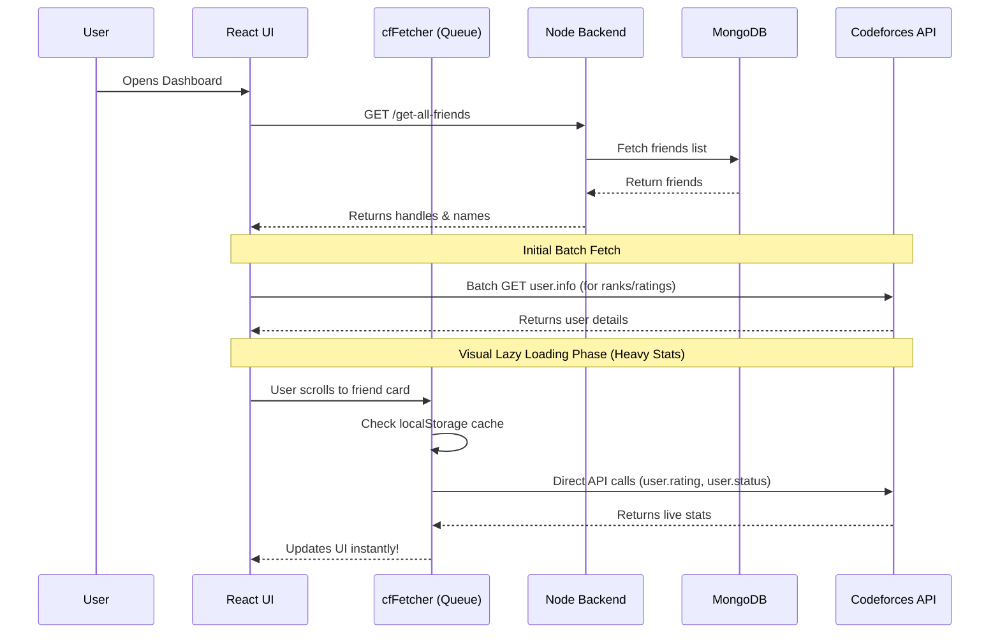

<div align="center">
  
# 🌌 CodeSphere

**Your ultimate companion for tracking Codeforces progress among friends.**  
A sleek, lightning-fast dashboard to monitor ratings, solved problems, and upcoming contests.

</div>

---

## ✨ Features

- **Live Codeforces Integration:** Automatically fetches live ratings, ranks, contribution points, and total solved problems for your friends.
- **Frontend Lazy-Loading Engine:** Solved problems and stats are lazy-loaded via a sophisticated frontend queue manager, completely bypassing backend rate-limiting!
- **Lightning Fast Caching:** Zero-latency browser `localStorage` caching ensures stats remain persistent across reloads.
- **Optimistic UI:** Buttery smooth user experience. Adding or deleting a friend instantly updates the UI without flashing skeletons or full-page reloads.
- **Dynamic Colored Ranks:** Friend cards dynamically match the official Codeforces rating colors (Newbie Gray ➔ Legendary Grandmaster Red).
- **Search & Filter:** Quickly find friends by handle or name using the real-time search bar.

---

## 🏗️ Architecture & Data Flow

CodeSphere uses an optimized serverless-hybrid architecture. The backend manages authentication and your friends list, while your personal browser talks directly to Codeforces to fetch massive statistics files. This distributed fetching completely protects the application from IP bans.



---

## 🚀 Getting Started

### Prerequisites
- [Node.js](https://nodejs.org/) installed
- A [MongoDB](https://www.mongodb.com/) cluster URI (Local or Atlas)

### 1. Clone the Repository
```bash
git clone https://github.com/jarchit27/CodeSphere.git
cd CodeSphere
```

### 2. Backend Setup
Navigate to the backend directory and install dependencies:
```bash
cd backend
npm install
```

Create a `.env` file in the `backend` directory:
```env
PORT=5000
MONGO_URI=your_mongodb_connection_string_here
ACCESS_TOKEN_SECRET=your_super_secret_jwt_key
```

Start the backend server (runs on Port 5000):
```bash
npm start
```

### 3. Frontend Setup
Open a new terminal, navigate to the frontend directory, and install dependencies:
```bash
cd frontend/cp_help
npm install
```

Start the Vite development server:
```bash
npm run dev
```

Your app will be running at `http://localhost:5173`. Enjoy tracking! 🚀

---

## 🛠️ Built With

* **Frontend:** React, Vite, Axios, React Icons, React Modal
* **Backend:** Node.js, Express, Mongoose, JWT (JSON Web Tokens), bcryptjs
* **Database:** MongoDB
* **External APIs:** Codeforces API (`user.rating`, `user.info`, `user.status`)
