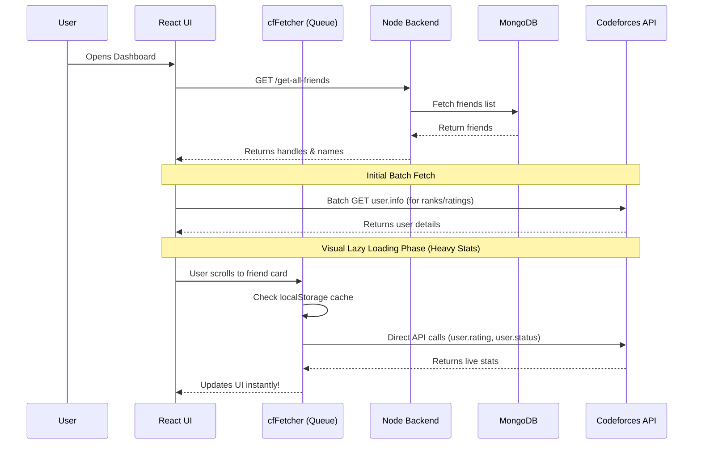

<div align="center">
  
# 🌌 CodeSphere

**Your ultimate companion for tracking Codeforces progress among friends.**  

A sleek, lightning-fast dashboard to monitor live ratings, solved problems, and upcoming contests without ever getting IP banned by Codeforces! Built with modern React and Node.js.

🚀 **Live Demo:** [https://codesphere-ivhb.onrender.com](https://codesphere-ivhb.onrender.com)

</div>

---

## ✨ Features

- **Live Codeforces Integration:** Automatically fetches live ratings, ranks, contribution points, and total solved problems for your friends directly from the official Codeforces API.
- **Frontend Lazy-Loading Engine:** Solved problems and stats are lazy-loaded via a sophisticated frontend queue manager (`cfFetcher`), completely bypassing backend rate-limiting!
- **Lightning Fast Caching:** Zero-latency browser `localStorage` caching ensures your heavy stats remain persistent across reloads for up to 6 hours.
- **Optimistic UI:** Buttery smooth user experience. Adding or deleting a friend instantly updates the UI without flashing skeletons or causing full-page reloads.
- **In-Depth Analysis:** Click on **View Analysis** for any friend to see beautiful graphs and charts of their submission history and rating changes (powered by Recharts and Chart.js).
- **Dynamic Colored Ranks:** Friend cards dynamically match the official Codeforces rating colors (Newbie Gray ➔ Legendary Grandmaster Red).
- **Bulletproof Authentication:** Complete with secure JWT sessions, Email OTP verification, spam protection, and a robust "Forgot Password" flow.
- **Production Ready:** Fully optimized for single-service deployment on Render.

---

## 🛠️ Tech Stack

### Frontend
- **Framework:** React 19 + Vite
- **Styling:** Tailwind CSS 4
- **Animations:** Framer Motion
- **Icons & UI:** Lucide React, React Icons, React Modal
- **Data Visualization:** Chart.js, Recharts, React Calendar Heatmap

### Backend
- **Environment:** Node.js + Express
- **Database:** MongoDB via Mongoose
- **Security:** JWT (JSON Web Tokens), bcryptjs
- **Utilities:** Cheerio (for occasional scraping needs)

---

## 📂 Directory Structure

```text
CodeSphere/
├── backend/
│   ├── models/            # Mongoose schemas (User, Friend, etc.)
│   ├── routes/            # Express API routes (Auth, Friends)
│   ├── index.js           # Main Express server entry point
│   ├── package.json       # Backend dependencies
│   └── .env               # Secrets (JWT, MongoDB URI)
│
└── frontend/cp_help/
    ├── src/
    │   ├── components/    # Reusable UI (Cards, Navbar, Modals)
    │   ├── pages/         # Core views (Home, Profile, Contests)
    │   ├── utils/         # Core utilities (cfFetcher.js queue engine)
    │   ├── App.jsx        # React Router configuration
    │   └── index.css      # Tailwind CSS directives & global styles
    ├── index.html         # Main HTML entry point
    ├── vite.config.js     # Vite bundler configuration
    └── package.json       # Frontend dependencies
```

---

## 🏗️ Architecture & Data Flow

CodeSphere uses an optimized serverless-hybrid architecture. The backend strictly manages authentication and your friends list. Meanwhile, your personal browser talks directly to Codeforces to fetch massive statistics files. This distributed fetching architecture completely protects the application server from IP bans.



---

## 🚀 Performance Optimizations (Deep Dive)

### 1. The `cfFetcher` Queue Engine
Fetching `user.status` for users with thousands of submissions (like tourist) can result in payloads of 10MB+. If the backend attempts to fetch this for 50 friends simultaneously, Codeforces blocks the IP address. 

To solve this, CodeSphere employs a custom frontend Singleton queue (`cfFetcher.js`).
- **Concurrency Control:** The queue strictly limits active outbound Codeforces requests to 3 at a time.
- **Deduplication:** Solved problems are carefully deduplicated by `submission.problem.name` or `contestId-index` matching the exact official Codeforces profile logic.
- **Timeouts:** Built-in sleep functions wait 250ms between requests to gracefully respect the API.

### 2. Zero-Latency Caching
Codeforces stats change frequently during contests but are relatively static otherwise. CodeSphere caches heavy API payloads in the browser's `localStorage` for **6 hours**. 
When you refresh the dashboard, the data loads instantly from memory with exactly 0 API calls required.

### 3. Optimistic UI Updates
Traditional React apps wait for a `POST /add-friend` request to finish before updating the screen. CodeSphere uses Optimistic UI:
- When you delete a friend, they instantly vanish from the UI.
- The server request happens silently in the background.
- This entirely eliminates the jarring "flicker" and Skeleton loaders usually associated with CRUD operations.

---

## 📡 Backend API Reference

The Node.js backend serves as a secure gateway for Authentication and basic User data.

### Authentication Routes
| Method | Endpoint | Description | Body |
|--------|----------|-------------|------|
| `POST` | `/api/auth/create-account` | Register and send OTP | `{ email, password, fullname, codeforcesHandle }` |
| `POST` | `/api/auth/verify-email` | Verify OTP to finalize signup | `{ email, otp }` |
| `POST` | `/api/auth/login` | Login and receive a JWT | `{ email, password }` |
| `POST` | `/api/auth/forgot-password`| Send reset OTP to email | `{ email }` |
| `POST` | `/api/auth/reset-password` | Reset password using OTP | `{ email, otp, newPassword }` |

### Friend Management Routes
*All these routes require a valid `Authorization: Bearer <token>` header.*

| Method | Endpoint | Description | Body |
|--------|----------|-------------|------|
| `GET`  | `/api/friends/get-all` | Fetches the user's friend list | `None` |
| `POST` | `/api/friends/add` | Adds a new friend to track | `{ handle, name }` |
| `PUT`  | `/api/friends/update/:id` | Updates a friend's details | `{ handle, name }` |
| `DELETE`| `/api/friends/delete/:id` | Deletes a tracked friend | `None` |

---

## 💻 Code Architecture Walkthrough

### The `FriendCard` Component
The workhorse of the dashboard. It implements an `IntersectionObserver` to detect when it enters the viewport. Until you scroll down to see a friend, their heavy stats (Contests/Solved) are completely ignored. Once visible, the card dispatches a request to the `cfFetcher` engine.

### The Profile Dashboard (`Profile.jsx`)
A dedicated analytical view for a single user. It compiles data from three separate Codeforces endpoints (`user.info`, `user.rating`, `user.status`) and pipes them through Chart.js adapters to render:
- **Rating History Line Chart:** Tracks progress over time.
- **Submission Heatmap:** GitHub-style contribution grid of daily problem-solving activity.
- **Language Distribution:** Pie chart breaking down C++, Python, and Java usage.

---

## ⚙️ Local Development Setup

### Prerequisites
- [Node.js](https://nodejs.org/) installed
- A [MongoDB](https://www.mongodb.com/) cluster URI (Local or Atlas)
- An Email account for OTP sending (Gmail with App Password recommended)

### 1. Clone the Repository
```bash
git clone https://github.com/jarchit27/CodeSphere.git
cd CodeSphere
```

### 2. Environment Variables
Create a `.env` file in the `backend` directory:
```env
PORT=5000
MONGO_URI=your_mongodb_connection_string_here
ACCESS_TOKEN_SECRET=your_super_secret_jwt_key
EMAIL_USER=your_email@gmail.com
EMAIL_PASS=your_app_password
NODE_ENV=development
```

### 3. Start the Backend
```bash
cd backend
npm install
npm start
```

### 4. Start the Frontend
Open a new terminal:
```bash
cd frontend/cp_help
npm install
npm run dev
```
Your app will be running at `http://localhost:5173`.

---

## 🚀 Deployment (Render)
CodeSphere is architected for seamless single-service deployment on Render. The backend Express server automatically builds and serves the compiled React frontend in production.

1. Connect your GitHub repository to a new Render **Web Service**.
2. **Build Command:** `npm run build` *(This runs the custom script in the root package.json)*
3. **Start Command:** `npm start`
4. Add your Environment Variables, ensuring `NODE_ENV=production` is set.
5. Deploy!

---

## 🔮 Future Roadmap
- [ ] Add support for AtCoder and LeetCode tracking.
- [ ] Implement WebSockets for live notifications when a friend submits a problem.
- [ ] Add Dark/Light mode toggles (currently defaults to an immersive Dark Theme).
- [ ] Group friends by custom tags (e.g., "College", "Rivals").

## 📝 License
Distributed under the MIT License. See `LICENSE` for more information.
